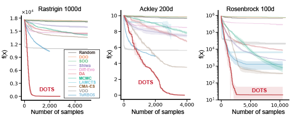

# VLab-Bench

`VLab-Bench` is a suite that offers benchmarks for real-world scientific design tasks and optimisation algorithms for materials science and biology. 

## Current results



## Available real-world tasks

The [currently available tasks](dots_benchmark/functions.py) are:

* Cyclic peptite binder design
* Electron ptychography: reconstruction optimisation

Please send us a PR to add your real-world task!

## Available synthetic function tasks

The [currently available functions](dots_benchmark/functions.py) are:

* Ackley
* Rastrigin
* Rosenbrock
* Levy
* Schwefel
* Michalewicz
* Griewank

## Available optimisation algorithms

The [currently available algorithms](dots_benchmark/algorithms.py) are:

* Derivative-free stOchastic Tree Search (DOTS, [Wei et al., 2024](https://arxiv.org/abs/2404.04062))
* MCTS_Greedy
* MCTS_eGreedy
* Dual Annealing
* Differential Evolution
* CMA-ES

Please send us a PR to add your algorithm!

## Installation

The code requires `python>=3.9`. Installation Tensorflow and Keras with CUDA support is stroongly recommended.

Install DOTS:

```
pip install git+https://github.com/poyentung/DOTS-Benchmark.git
```

or clone the repository to local devices:

```
git clone git@github.com:poyentung/DOTS-Benchmark.git
cd DOTS; pip install -e .
```

## Quick start

Here we evaluate DOTS on Ackley in 10 dimensions for 1000 samples.

- **Using exact oracle function**: 
```
python3 -m dots_benchmark.scripts.run_oracle\
        --func ackley\
        --dims 10\
        --samples 1000\
        --method DOTS
```


- **Using neural network surrogate**: 
```
python3 -m dots_benchmark.scripts.run_surrogate\
        --func ackley\
        --dims 10\
        --samples 1000\
        --method DOTS
```

## Running unit tests

## License

The source code is released under the MIT license, as presented in [here](LICENSE).